<div align="center">

# Toolgate

### 업무를 설명하면, 쓸 수 있는 도구를 찾습니다.

**사내 SaaS · 생성형 AI 도구 보안 사전점검 및 도입 셀프서비스 플랫폼**

임직원은 하려는 업무를 자연어로 설명하기만 하면 됩니다.<br/>
데이터 민감도 판정, 사내 보안정책 대조, 유휴 라이선스 확인까지 시스템이 한 흐름으로 처리합니다.

<br/>


<br/>

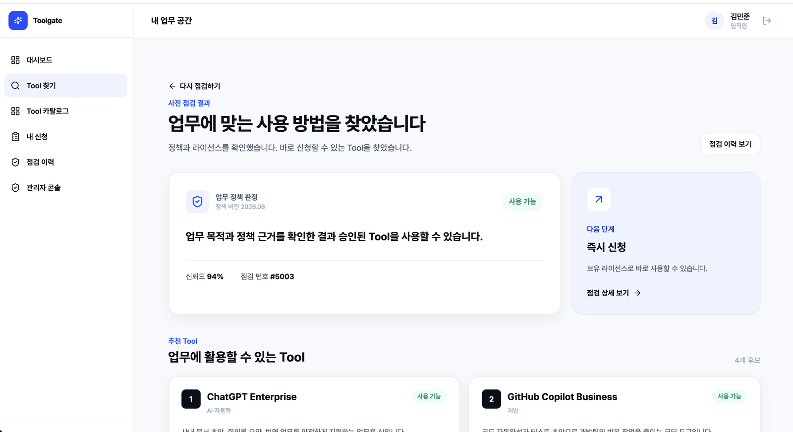

<br/>

**[→ In-house SaaS Security Pre-inspection Platform 저장소 바로가기](https://github.com/5jo-s/In-house-SaaS-Security-Pre-inspection-Platform)**

</div>

<br/>

## 왜 만들었나

SaaS와 생성형 AI 도구가 부서 단위로 빠르게 도입되면서, 기업은 **쓰지 않는 라이선스에 돈을 내는 문제**와 **승인되지 않은 도구로 데이터가 새는 문제**를 동시에 겪고 있습니다.

| 구분 | 확인된 수치 | 출처 |
| --- | --- | --- |
| 미사용 라이선스 지출 | NASA, 5년간 미사용 오라클 라이선스에 **약 1,500만 달러** 지출 | NASA OIG `IG-23-008` (2023-01) |
| 미승인 AI 도구 유출 | 삼성전자 DS 부문, **20일 만에 3건**의 사내 자료가 ChatGPT에 입력 | Bloomberg (2023-05) |
| 라이선스 미사용률 | 기업 보유 SaaS 라이선스의 **평균 36%가 미사용** 상태 | Zylo, 2026 SaaS Management Index |

> **한 줄 문제 정의**<br/>
> 사내 SaaS 툴 정보와 도입 프로세스의 파편화로 인해, 임직원의 탐색 비용이 증가하고 관리자의 중복 검토 및 불필요한 라이선스 구매 등 리소스 낭비가 발생한다.

<br/>

## 무엇이 다른가

기존 SaaS 관리 솔루션이 **관리자 관점의 자산·사용량·비용 관리**에 집중한다면, Toolgate는 **임직원의 업무 요구**에서 출발합니다.

| | 기존 방식 | Toolgate |
| --- | --- | --- |
| **시작점** | 도구 이름을 알아야 신청 가능 | 업무 목적을 자연어로 설명 |
| **데이터 등급** | 사용자가 직접 선택 | 업무 설명에서 시스템이 추론 |
| **보안 판정** | 담당자가 규정을 찾아 수기 검토 | 사내 정책 문서 RAG 검색 → 근거와 함께 자동 판정 |
| **구매 요청** | 보유 자산 확인 없이 신규 구매 | 유휴 라이선스를 먼저 제안, 없을 때만 구매 검토 |
| **검토 큐** | 저위험·고위험 요청이 한 큐에 혼재 | 저위험은 자동 통과, `REVIEW_REQUIRED`만 관리자에게 |

<br/>

## 화면 플로우

### SC-01 · 가입 / 로그인

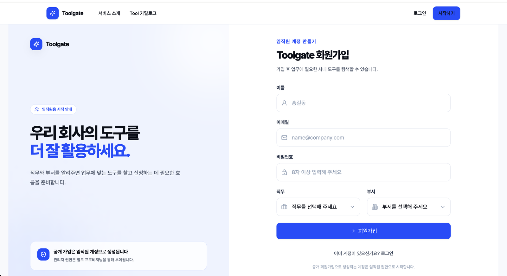

공개 회원가입으로 생성되는 계정은 임직원 권한으로 시작하며, 관리자 권한은 별도 프로비저닝으로 부여됩니다.

<br/>

### SC-02 · Tool 찾기 — 업무 목적만 입력합니다

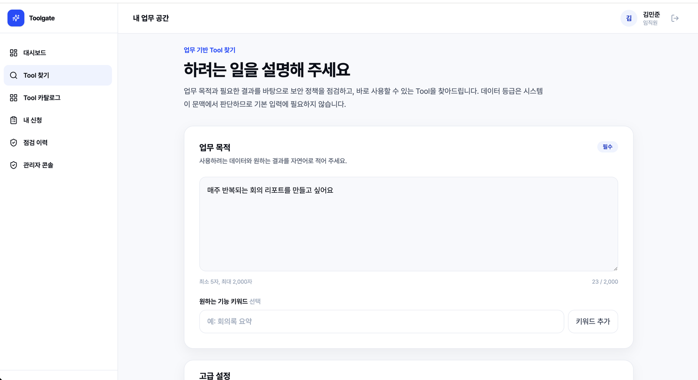

**데이터 등급 선택 항목이 없습니다.** 업무 설명 문맥에서 시스템이 민감도를 판정하기 때문입니다.<br/>
필요한 기능 키워드와 고급 설정은 모두 선택 사항입니다.

<br/>

### SC-03 · 점검·추천 결과

판정 배지, 판정 사유, 신뢰도, 점검 번호가 함께 제시됩니다.


이어서 업무에 활용할 수 있는 Tool 후보가 **추천 점수 · 남은 라이선스**와 함께 정렬됩니다.<br/>
좌석이 남아 있으면 `즉시 신청`, 좌석이 0석이면 `구매 승인 요청`으로 버튼이 갈립니다.

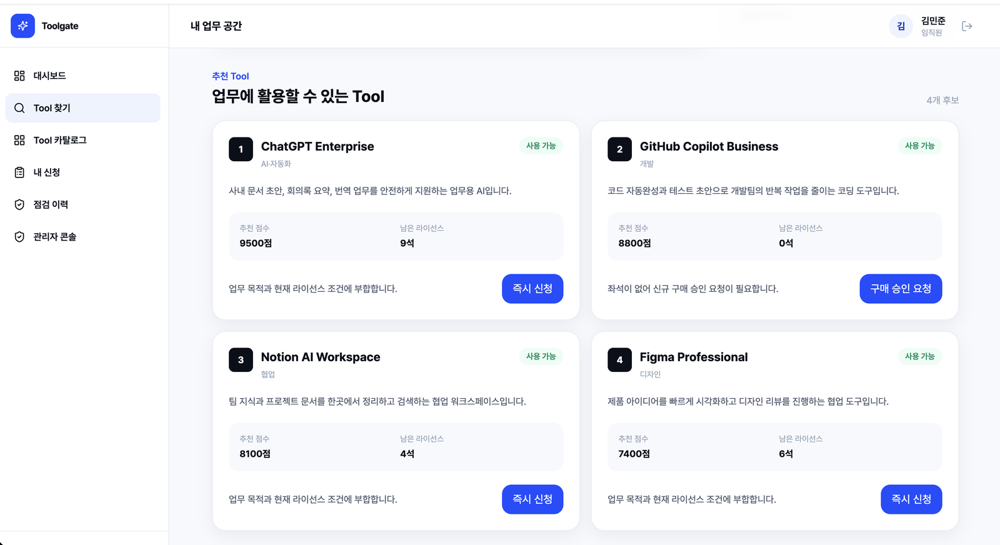

모든 판정에는 **근거가 된 정책 문서의 실제 구간**이 관련도 점수와 함께 따라붙습니다.

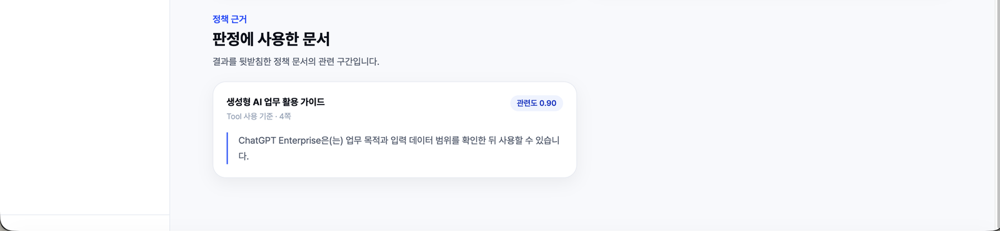

<br/>

### SC-04 · 내 신청 / 점검 이력

신청한 Tool의 판정 결과, 라이선스 출처(`AVAILABLE_LICENSE` · `NEW_PURCHASE`), 신청 상태를 한곳에서 추적합니다.

<br/>

### SC-05 · 관리자 콘솔

보안 검토 대기, 구매 승인 대기, 좌석 부족 Tool, 등록 라이선스 비용을 한 화면에서 확인합니다.

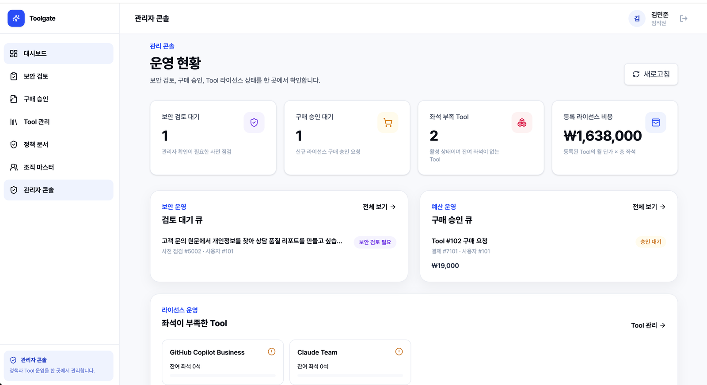

Tool별 메타데이터와 라이선스 재고를 직접 관리하고, 사내 보안정책 문서를 업로드·활성화합니다.

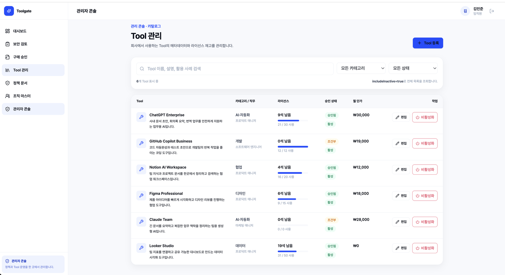

<br/>

## 두 가지 시나리오로 보는 판정

<table>
<tr>
<th width="50%">AT-01 · 저위험 업무는 자동 통과</th>
<th width="50%">AT-02 · 민감정보는 검토 큐로</th>
</tr>
<tr>
<td valign="top">

입력: *"매주 반복되는 회의 리포트를 만들고 싶어요"*


</td>
<td valign="top">

입력: *"고객 주민등록번호 반복 입력이 힘들어요"*

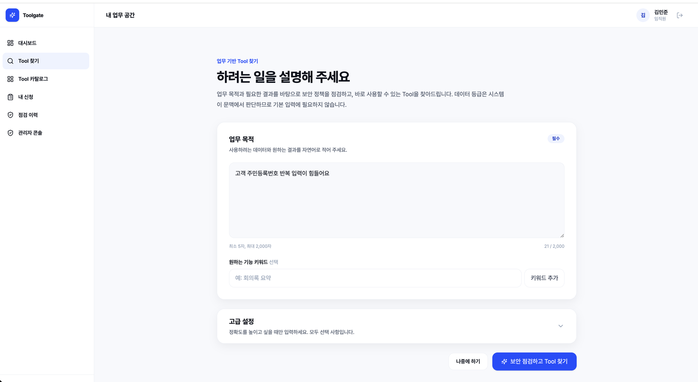

</td>
</tr>
<tr>
<td valign="top">

**결과 — 사용 가능** (신뢰도 94%)


보유 라이선스로 **즉시 신청**. 관리자 개입이 없습니다.

</td>
<td valign="top">

**결과 — 보안 검토 필요** (신뢰도 82%)

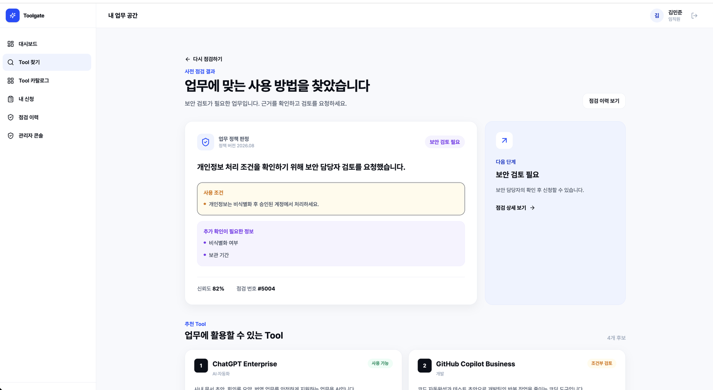

사용자가 `PII`라고 쓰지 않았는데도 시스템이 개인정보를 감지하고, **사용 조건**과 **추가 확인이 필요한 정보**를 제시한 뒤 검토 큐에 적재합니다.

</td>
</tr>
</table>

민감정보 업무에서는 모든 Tool 카드가 `조건부 검토` 상태로 잠기고, 보안 담당자의 확인 이후에만 신청이 열립니다.

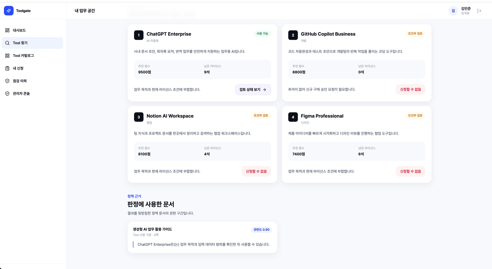

<br/>

## 시스템 아키텍처

Spring Cloud 기반 MSA입니다. Eureka 서비스 디스커버리, OAuth2 인증 서버, API Gateway 뒤에 4개의 Spring Boot 서비스와 1개의 FastAPI RAG 서비스가 있고, Vue 3 SPA가 앞단에 붙습니다.

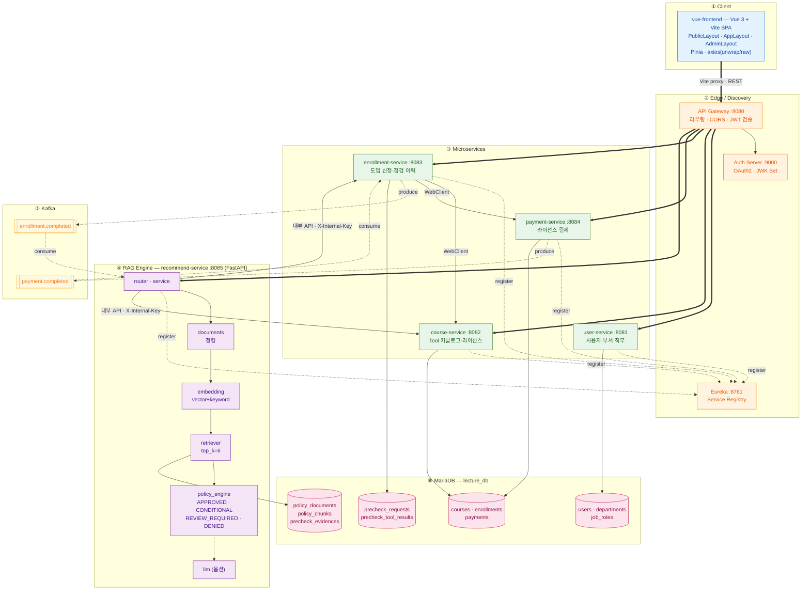

### 사전점검 요청이 흐르는 경로

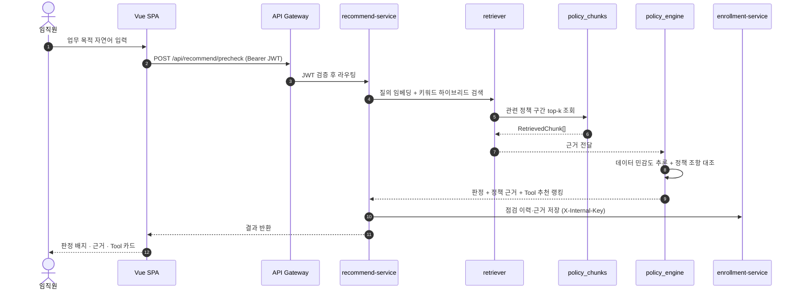

<br/>

## 기술 스택

| 영역 | 사용 기술 |
| --- | --- |
| **Frontend** | Vue 3, Vite, Vue Router, Pinia, Tailwind CSS, axios |
| **Backend** | Spring Boot 3, Spring Cloud Gateway, Spring Data JPA, Spring Security (OAuth2 Resource Server), WebClient |
| **RAG Service** | Python, FastAPI, Pydantic, 하이브리드 검색 (벡터 + 키워드), OpenAI 호환 LLM 연동(옵션) |
| **Service Discovery** | Netflix Eureka |
| **Auth** | OAuth2 Authorization Server, JWT, JWK Set |
| **Messaging** | Apache Kafka (KRaft), DLT 기반 실패 처리 |
| **Database** | MariaDB 11.2 |
| **Infra** | Docker, Docker Compose, Gradle |

<br/>

## 서비스 구성

| 서비스 | 포트 | 설명 |
| --- | --- | --- |
| `vue-frontend` | 3000 | Vue 3 SPA |
| `api-gateway` | 8080 | 단일 진입점 |
| `auth-server` | 9000 | OAuth2 토큰 발급 |
| `eureka-server` | 8761 | 서비스 레지스트리 |
| `user-service` | 8081 | 사용자 · 조직 |
| `course-service` | 8082 | Tool 카탈로그 · 라이선스 |
| `enrollment-service` | 8083 | 도입 신청 · 점검 이력 |
| `payment-service` | 8084 | 라이선스 결제 |
| `recommend-service` | 8085 | RAG 보안 사전점검 · 추천 |
| `mariadb` | 3379 → 3306 | `lecture_db` |
| `kafka` | 9092 | 이벤트 브로커 |

기동 순서는 `depends_on` 헬스체크로 강제됩니다.

```
MariaDB / Kafka  →  Eureka  →  Auth Server  →  API Gateway + 4개 서비스  →  Recommend Service
```

<br/>

## 실행 방법

```bash
git clone https://github.com/5jo-s/In-house-SaaS-Security-Pre-inspection-Platform.git
cd In-house-SaaS-Security-Pre-inspection-Platform

# 공통 이미지 로드 (API Gateway, Auth Server)
docker load -i infra-images.tar

# 백엔드 전체 기동
docker compose build --no-cache && docker compose up -d

# 서비스 등록 상태 확인 → http://localhost:8761
# 프론트엔드 실행
cd vue-frontend && npm install && npm run dev   # http://localhost:3000
```

> [!NOTE]
> 브라우저 호출은 반드시 Vite 프록시를 통해야 합니다. 게이트웨이 CORS 허용 목록이 `http://localhost:3000`으로 고정되어 있어, `127.0.0.1:3000`이나 LAN IP로 접속하면 preflight가 403으로 실패합니다.

<br/>

## 저장소 · 문서

| | |
| --- | --- |
| **메인 저장소** | [In-house-SaaS-Security-Pre-inspection-Platform](https://github.com/5jo-s/In-house-SaaS-Security-Pre-inspection-Platform) |
| **PRD** | [docs/PRD_final.md](https://github.com/5jo-s/In-house-SaaS-Security-Pre-inspection-Platform/blob/main/docs/PRD_final.md) — 문제 정의, 가설 H-0~H-3, 화면 플로우, MVP 범위 |
| **명세 · 보고서** | [docs/](https://github.com/5jo-s/In-house-SaaS-Security-Pre-inspection-Platform/tree/main/docs) — API 명세, 요구사항 명세, ERD, 테스트 보고서 |
| **DB 스키마** | [init-db/](https://github.com/5jo-s/In-house-SaaS-Security-Pre-inspection-Platform/tree/main/init-db) |
| **시드 · 검증 스크립트** | [scripts/seed/](https://github.com/5jo-s/In-house-SaaS-Security-Pre-inspection-Platform/tree/main/scripts/seed) |

<br/>

---

<div align="center">
<sub>SKALA Agile · MSA 실습 프로젝트 — 7반 5조</sub>
</div>
